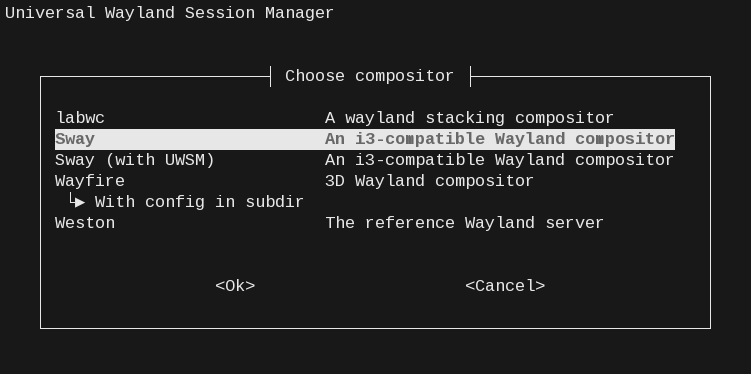

# Universal Wayland Session Manager

Provides a set of Systemd units and helpers to set up the environment and manage
standalone Wayland compositor sessions.

Aside from environment setup/cleanup, it makes Systemd do most of the work and
does not require any extra daemons running in background (except for two tiny
`waitpid` processes in the lightest case).

This setup provides robust session management, overridable compositor- and
session-aware environment management, XDG autostart, bi-directional binding with
login session, clean shutdown.

For compositors this is an opportunity to offload: Systemd integration,
session/XDG autostart management, Systemd/DBus activation environment
interaction with its caveats.

> [!IMPORTANT]
> This project is currently in a stable phase with a slow-burning refactoring.
> Although no drastic changes are planned, keep an eye for commits with breaking
> changes, indicated by an exclamation point (e.g. `fix!: ...`, `chore!: ...`,
> `feat!: ...`, etc.).

> [!NOTE]
> It is highly recommended to use
> [dbus-broker](https://github.com/bus1/dbus-broker) as the D-Bus daemon
> implementation. Among other benefits, it reuses the systemd activation
> environment instead of having a separate one. This simplifies environment
> management and allows proper cleanup. Reference D-Bus implementation is also
> supported, but it doesn't allow unsetting vars, so a best effort cleanup is
> performed by setting them to an empty string instead. The only way to properly
> clean up the separate environment of the reference D-Bus daemon is to run
> `loginctl terminate-user ""`.



## Concepts and features

<details><summary>
Uses systemd units and dependencies for startup, operation, and shutdown.
</summary>

- Binds to the basic
  [structure](https://systemd.io/DESKTOP_ENVIRONMENTS/#pre-defined-systemd-units)
  of `graphical-session-pre.target`, `graphical-session.target`,
  `xdg-desktop-autostart.target`.
- Adds custom nested slices `app-graphical.slice`,
  `background-graphical.slice`, `session-graphical.slice` to put apps in and
  terminate them cleanly on exit.
- Provides convenient way of
  [launching apps into those slices](https://systemd.io/DESKTOP_ENVIRONMENTS/#xdg-standardization-for-applications).

</details>

<details><summary>
Systemd units are treated with hierarchy and universality in mind.
</summary>

- Templated units with specifiers.
- Named from common to specific where possible.
- Allowing for high-level `name-.d` drop-ins.

</details>

<details><summary>
Bi-directional binding between login session and graphical session.
</summary>

Using `waitpid` utility (or a built-in shim) together with native systemd
mechanisms, uwsm binds lifetime of a login session (`session-N.scope` system
unit) to graphical session (a set of user units) and vice versa.

</details>

<details><summary>
Compositor-specific behavior is adjustable by plugins.
</summary>

Currently included:

- `sway`
- `wayfire`
- `labwc`
- `hyprland`

</details>

<details><summary>
Idempotently (well, best-effort-idempotently) handles environment.
</summary>

- On startup a specialized unit prepares environment by:
  - either loading environment context saved by `uwsm start` command or sourcing
    shell profile by itself
  - sourcing `uwsm/env`, `uwsm/env-${desktop}` files from each dir of reversed
    sequence `${XDG_CONFIG_HOME}:${XDG_CONFIG_DIRS}:${XDG_DATA_DIRS}` (in
    increasing priority), where `${desktop}` is each item of
    `${XDG_CURRENT_DESKTOP}`, lowercased
- Difference between environment state before and after preparation is exported
  into systemd user manager (and D-Bus activation environment if reference D-Bus
  implementation is used)
- On shutdown previously exported variables are unset from systemd user manager
  (activation environment of reference D-Bus daemon does not support unsetting,
  so those vars are emptied instead (!))
- Lists of variables for export and cleanup are determined algorithmically by:
  - comparing environment before and after preparation procedures
  - boolean operations with predefined lists
  - manually exported vars by `uwsm finalize` action

</details>

<details><summary>
Can work with Desktop entries from `wayland-sessions` in XDG data hierarchy
and/or be included in them.
</summary>

- Actively select and launch compositor from Desktop entry (which is used as
  compositor instance ID):
  - Data taken from entry (can be amended or overridden via CLI arguments):
    - `Exec` for argument list
    - `DesktopNames` for `XDG_CURRENT_DESKTOP` and `XDG_SESSION_DESKTOP`
    - `Name` and `Comment` for unit `Description`
  - Entries can be overridden, masked or added in
    `${XDG_DATA_HOME}/wayland-sessions/`
  - Optional interactive selector (requires `whiptail`), choice is saved in
    `${XDG_CONFIG_HOME}/uwsm/default-id`, default is read from it, falling back
    all the way through `${XDG_CONFIG_DIRS}:${XDG_DATA_DIRS}`
  - Desktop entry
    [actions](https://specifications.freedesktop.org/desktop-entry-spec/latest/extra-actions.html)
    are supported
- Be launched via a Desktop entry by a login/display manager.

</details>

<details><summary>
Can run with arbitrary compositor command line, or take it (along with other data) from desktop entries (saved as a unit drop-in).
</summary>

```
wayland-wm-env@${compositor}.service.d/50_custom.conf
wayland-wm@${compositor}.service.d/50_custom.conf
```

</details>

<details><summary>
Provides better control of XDG autostart apps.
</summary>

- XDG autostart services (`app-*@autostart.service` units) are placed into
  `app-graphical.slice` that receives stop action before compositor is stopped.
- Can be mass-controlled via stopping and starting
  `wayland-session-xdg-autostart@${compositor}.target`

</details>

<details><summary>
Tries best to shutdown session cleanly via a net of dependencies between units.
</summary>

Basic provided unit files (can be transiet if project built with
`static-units=disabled`):

```
background-graphical.slice
app-graphical.slice
session-graphical.slice
wayland-session-pre@.target
wayland-session-shutdown.target
wayland-session-xdg-autostart@.target
wayland-session@.target
wayland-wm-app-daemon.service
wayland-wm-env@.service
wayland-wm@.service
wayland-session-bindpid@.service
wayland-session-waitenv.service
```

Managed generated files (in `${XDG_RUNTIME_DIR}/systemd/user` or
`${XDG_CONFIG_HOME}/systemd/user` depending on `-U` opton):

Compositor metadata customization drop-ins:

```
wayland-wm-env@${compositor}.service.d/50_custom.conf
wayland-wm@${compositor}.service.d/50_custom.conf
```

Tweaks for other units:

```
app-@autostart.service.d/slice-tweak.conf
plasma-xdg-desktop-portal-kde.service.d/order-tweak.conf

```

See [Longer story](#longer-story-tour-under-the-hood) section below for
descriptions.

</details>

<details><summary>
Provides helpers and tools for various operations.
</summary>

- `uwsm finalize`: for explicitly exporting variables to activation environments
  and signal compositor's unit readiness (compositor service unit uses
  `Type=notify`)
- `uwsm check may-start`: for checking conditions for launch at login (for
  integration into login shell profile)
- `uwsm app`: for launching applications as scopes or services in proper slices
  - desktop entries or plain executables are supported
  - support for launching a terminal/in terminal
    ([proposed xdg-terminal-exec](https://gitlab.freedesktop.org/terminal-wg/specifications/-/merge_requests/3))
  - flexible unit metadata support
- `uwsm-app`: a simple and fast shell client to app-daemon feature of uwsm, a
  drop-in replacement of `uwsm app`. The daemon (started on-demand) handles
  finding requested desktop entries, parsing and generation of commands for
  client to execute. This avoids the overhead of repeated python startup and
  increases app launch speed.
- `uuctl`: graphical (via dmenu-like menus) tool for managing user units.
- `fumon`: background service for notifying about failed units.

</details>

## Installation and basic configuration

### 1. Building and installing

Checkout the last version-tagged commit. Untagged commits are WIP.

<details><summary>
Building and installing the python project directly.
</summary>

```
meson setup --prefix=/usr/local -Duuctl=enabled -Dfumon=enabled -Duwsm-app=enabled build
meson install -C build
```

The example enables optional tools `uuctl`, `fumon`, and `uwsm-app` available in
this project (see _helpers and tools_ spoiler in
[concepts section](#concepts-and-features) above).

</details>

<details><summary>
Building and installing a deb package.
</summary>

Read and run `./build-deb.sh -i`

Alternatively,

```
IFS='()' read -r _ current_version _ < debian/changelog
sudo apt install devscripts
mk-build-deps
sudo apt install --mark-auto ./uwsm-build-deps_${current_version}_all.deb
dpkg-buildpackage -b -tc --no-sign
sudo apt install ../uwsm_${current_version}_all.deb
```

</details>

<details><summary>
Arch.
</summary>

`pacman -S uwsm`

</details>

<details><summary>
NixOS options.
</summary>

Enable it using `programs.uwsm.enable` and configure available compositors using
`programs.uwsm.waylandCompositors`. Please see the
[options' descriptions](https://search.nixos.org/options?channel=unstable&show=programs.uwsm.enable&from=0&size=50&sort=relevance&type=packages&query=uwsm)
for more information.

</details>

Runtime dependencies:

- python modules:
  - xdg (pyxdg)
  - dbus (dbus_python)
- `waitpid` (optional, but recommended for resources; from `util-linux` or
  `util-linux-extra` package)
- `whiptail` (optional, for `select` feature; from `whiptail` or `libnewt`
  package)
- a dmenu-like menu (optional; for `uuctl` script), supported:
  - `fuzzel`
  - `walker`
  - `wofi`
  - `rofi`
  - `tofi`
  - `bemenu`
  - `wmenu`
  - `dmenu`
- `notify-send` (optional, for feedback from `uwsm app` commands and
  optional failed unit monitor `fumon` service; from `libnotify-bin` or
  `libnotify` package)

### 2. Service startup notification and vars set by compositor

Potentially tricky part.

TLDR; if your compositor puts `WAYLAND_DISPLAY` (and **along with it**
`DISPLAY`, or other important or useful variables) into systemd activation
environment, uwsm will make everything work automagically, proceed to section 3.

Otherwise configure compositor to run `uwsm finalize` command at the end of its
startup. It will deal with putting `WAYLAND_DISPLAY` and `DISPLAY` (if set)
variables into activation environments in the best possible ways and signal unit
readiness to systemd.

<details><summary>
If compositor is known to set useful vars but they are missing from activation
environments.
</summary>

List names of variable as arguments to `uwsm finalize`, or **append** them to
whitespace-separated list in `UWSM_FINALIZE_VARNAMES` variable (do it
beforehand, i.e. in env files or shell profile).

Example snippet for sway config (these vars are already covered by sway plugin
via `UWSM_FINALIZE_VARNAMES` var and listed here just for clearness):

```
exec exec uwsm finalize SWAYSOCK I3SOCK XCURSOR_SIZE XCURSOR_THEME
```

Undefined variables will be are silently ignored.

</details>

<details><summary>
If graphical session is reached prematurely, i.e. compositor puts other vars
into activation environments much later than `WAYLAND_DISPLAY`, too late for
downstream units to get.
</summary>

**Append** names of variables to whitespace-separated list in
`UWSM_WAIT_VARNAMES` variable (do it beforehand, i.e. in env files or shell
profile). This will make uwsm delay graphical session startup until those vars
appear in the systemd activation environment.

Depending on the situation, combine this with with `uwsm finalize` command to
put more variables into activation environments and gain more control over delay
mechanism of uwsm.

Be aware that `uwsm finalize` skips undefined vars, so be sure that all
vars listed in `UWSM_WAIT_VARNAMES` are really being set, or use explicit
assignment to serve as a marker. Example:

```
# in env file:
export UWSM_WAIT_VARNAMES="${UWSM_WAIT_VARNAMES} FINALIZED"

# in compositor's autostart:
uwsm finalize FINALIZED="I'm here" SWAYSOCK I3SOCK XCURSOR_SIZE XCURSOR_THEME
```

You can also tweak `UWSM_WAIT_VARNAMES_SETTLETIME` (float, default: 0.2) to
change pause duration after all expected vars are found.

</details>

<details><summary>
Technical details
</summary>

Inside `wayland-wm@${compositor}.service` before executing compositor itself,
uwsm forks a process that probes systemd activation environment for
`WAYLAND_DISPLAY` var and vars listed in `UWSM_WAIT_VARNAMES` variable
(whitespace-separated). When all expected vars appear, it pauses for
`UWSM_WAIT_VARNAMES_SETTLETIME` seconds (float, default: 0.2) and signals unit
readiness. It also updates cleanup list with delta between states of activation
environment at unit startup time and the end of settle pause. If classic D-Bus
implementation is used, this delta is also synched to its activation
environment.

A separate unit, `wayland-session-waitenv.service` is launched alongside
compositor, with similar ordering after `graphical-session-pre.target`, before
`graphical-session.target`. It also waits for the same variables in the same
manner, then successfully exits (or times out). Its job is to delay
`graphical-session.target` activation in case compositor signals its readiness
prematurely. Or to fail startup if expected vars do not appear.

The `uwsm finalize` command fills systemd and D-Bus environments with essential
vars set by the compositor: `WAYLAND_DISPLAY` (mandatory) and `DISPLAY` (if
present). Optional vars are taken by name from arguments and
`UWSM_FINALIZE_VARNAMES` var, which is also pre-filled by plugins. D-Bus
implementation quirks are handled. Undefined vars are silently ignored. Any
exported variables are also added to cleanup list.

Timeout for unit startup is 10 seconds.

</details>

### 3. Applications and Slices

Applications should be launched in their own user-level systemd units.

Some applications (usually those intended to be autostarted in a graphical
session) are shipped with their own units. Check and enable them with:
`systemctl --user enable ...`.

<details><summary>
More info
</summary>

* `systemctl --user enable this-app.service` (if it provides
  `WantedBy=graphical-session.target`)
* `systemctl --user add-wants graphical-session.target that-app.service` (if it
  does not)

In the end autostarted unit should have both dependency and ordering (be wanted
by a target and ordered after it) see [example-units](./example-units/).

Or just start with `systemctl --user start not-a-service.service`.

Units can be fully or partially overridden/edited via standard systemd
mechanisms.

</details>

Other apps are shipped with XDG autostart entries. Systemd automatically
converts them to `app-*@autostart.service` units and starts.

<details><summary>
More info
</summary>

Their `OnlyShowIn=`/`NotShowIn=` lists should align with `$XDG_CURRENT_DESKTOP`
items or be absent. Autostart entries can be overridden by copying and editing
them in `${XDG_CONFIG_HOME}/autostart/`. Generated
`app-*@autostart.service` units are editable via drop-ins.

Also see [example-units](./example-units/) and refer to
[Desktop Application Autostart Specification](https://xdg.pages.freedesktop.org/xdg-specs/autostart-spec/latest/)

</details>

To launch any other app use:

```
uwsm app -- {executable|entry.desktop[:action]} [args ...]
```

A one-shot app launcher can be started directly, but either configured to run
things via `uwsm app` or wrapped in a shell expression to handle output.
Not all launchers are able to provide Desktop Entry ID, most just provide the
resulting command, so units will lack fancy description.
Some examples:

| Launcher | Via     | What                                                                                                                                                                             | Entry |
| -------- | ------- | -------------------------------------------------------------------------------------------------------------------------------------------------------------------------------- | ----- |
| fuzzel   | command | `fuzzel "--launch-prefix=uwsm app --"`                                                                                                                                           | no    |
| fuzzel   | config  | `launch-prefix=uwsm app --`                                                                                                                                                      | no    |
| albert   | env var | `ALBERT_APPLICATIONS_COMMAND_PREFIX`: `uwsm;app;--`                                                                                                                              | no    |
| albert   | shell   | `ALBERT_APPLICATIONS_COMMAND_PREFIX="uwsm;app;--" albert`                                                                                                                        | no    |
| walker   | config  | `app_launch_prefix = "uwsm app -- "`                                                                                                                                             | no    |
| wofi     | shell   | `uwsm app -- "$(wofi --show drun --define=drun-print_desktop_file=true \| sed -E "s/(\.desktop) /\1:/")"`                                                                        | yes   |
| wofi     | shell   | `uwsm app -- "$(D=$(wofi --show drun --define=drun-print_desktop_file=true); case "$D" in *'.desktop '*) echo "${D%.desktop *}.desktop:${D#*.desktop }";; *) echo "$D";; esac)"` | yes   |
| tofi     | shell   | `uwsm app -- $(tofi-drun)`                                                                                                                                                       | no    |
| rofi     | command | `rofi -show drun -run-command "uwsm app -- {cmd}"`                                                                                                                               | no    |

Compositor itself runs in `session.slice` which has priority in some resource
allocation. It would be a bad practice to accumulate all apps there, and
extremely bad practice to accumulate processes inside compositor's unit itself.

<details><summary>
Faster alternatives
</summary>

`uwsm app` can be quite slow on some setups due to repeated python startup
overhead.

Included optional `uwsm-app` script uitilizes uwsm's on-demand app daemon for
more responsiveness in repeated interactive launching.

[app2unit](https://github.com/Vladimir-csp/app2unit) is a faster shell
alternative, with feature parity. It can also be used outside uwsm environment
and can integrate with [Fuzzel](https://codeberg.org/dnkl/fuzzel/).

[runapp](https://github.com/c4rlo/runapp) a fast C++ executable, although it is
not feature-complete yet.

</details>

<details><summary>
Background and details
</summary>

`uwsm` launches the compositor's service as `wayland-wm@${compositor}.service`
in `session.slice`.

Processes descendent from the compositor will be a part of its unit which
**might** be mostly OK for short-lived one-off commands, i.e. volume adjustment.
But processes inside comopositor's unit will have brief access to its
notification socket before it is restricted after startup is complete. This may
lead to unforeseen consequences, like compositor unit being erroneously
declared entering stopping state.

Systemd
[documentation](https://systemd.io/DESKTOP_ENVIRONMENTS/#pre-defined-systemd-units)
recommends launching apps as their own units (scopes or services). `app.slice`
would be the default destination, `background.slice` and `session.slice` are
available for low-priority non-interactive tasks and high-prioirity
responsiveness-aware tasks respectively, (see `man systemd.special`)

`uwsm` provides a convenient way of handling this: special nested slices that
will also receive stop action before
`wayland-wm@${compositor}.service` shutdown:

- `app-graphical.slice` (default destination)
- `background-graphical.slice`
- `session-graphical.slice`

`app-*@autostart.service` units of XDG autostart entries are also modified to be
started in `app-graphical.slice`.

To launch an app inside one of those slices, use:

`uwsm app [-s a|b|s|custom.slice] [-t scope|service] -- your_app [with args]`

Launching desktop entries via a
[valid ID](https://specifications.freedesktop.org/desktop-entry-spec/latest/file-naming.html#desktop-file-id)
is also supported (optionally with an
[action ID](https://specifications.freedesktop.org/desktop-entry-spec/latest/extra-actions.html)
appended via `:`):

`uwsm app [-s a|b|s|custom.slice] [-t scope|service] -- your_app.desktop[:action] [with args]`

In this case args must be supported by the entry or its selected action
according to the
[XDG Desktop Entry Specification](https://specifications.freedesktop.org/desktop-entry-spec/latest).

Specifying paths to executables or desktop entry files is also supported.

Always use `--` to disambiguate command line if any dashed arguments are
intended for the app being launched.

**Scopes** are the default type of units for launching apps via `uwsm app`, they
are executed in-place and behave like simple commands, inheriting environment
and pty of origin.

**Services** are launched in the background by the systemd user manager and are
given an environment based on the current state of the activation environment of
systemd; their output is routed to the journal. `uwsm app` will return
immediately after launch. This allows more control over the application, i.e.
restarting it with an updated environment.

Example snippets for sway config for launching apps:

Launch
[proposed](https://gitlab.freedesktop.org/terminal-wg/specifications/-/merge_requests/3)
default terminal:

`bindsym --to-code $mod+t exec exec uwsm app -T`

Fuzzel has a very handy launch-prefix option:

`bindsym --to-code $mod+r exec exec fuzzel --launch-prefix='uwsm app --'`

Walker can prefix launching apps by setting `app_launch_prefix` variable in the config, so `"app_launch_prefix": "uwsm app -- "`.

Launch SpaceFM via a desktop entry:

`bindsym --to-code $mod+e exec exec uwsm app spacefm.desktop`

Featherpad desktop entry has "standalone-window" action:

`bindsym --to-code $mod+n exec exec uwsm app featherpad.desktop:standalone-window`

Unit type of launched apps can be controlled by `-t service|scope` argument or
setting its default via `UWSM_APP_UNIT_TYPE` env var.

</details>

### 4. Environments and shell profile

There are three general groups of environment variables in graphical session
operation:

- those that all/some apps need to see
- those that compositor needs to see
- those that compositor sets and graphical apps need to see (this was covered in
  [section 2](#2-service-startup-notification-and-vars-set-by-compositor))

Summary of where to put a user-level var for the first two categories:

- For user's systemd services, including compositor: define in
  `${XDG_CONFIG_HOME}/environment.d/*.conf`. It does not affect login sessions
  or systemd user manager itself (see `man 5 environment.d`).
- For login shell context and uwsm environment preloader, including plugins:
  export in your shell's profile.
- For uwsm-managed graphical session: export in `${XDG_CONFIG_HOME}/uwsm/env`
- For uwsm-managed graphical session of specific compositor: export in
  `${XDG_CONFIG_HOME}/uwsm/env-${desktop}`

Choose whatever scope suits your needs.

If startup was initiated via `uwsm start` command, its environment will be
saved and picked up by environment preloader (since `uwsm start` is supposed to
be started from login session context, it is assumed that profile of the login
shell was already sourced).

Otherwise, environment preloader will source POSIX shell (`/bin/sh`) profile by
itself (`/etc/profile`, `${HOME}/.profile`). Other shells compatibility with
these files may vary.

## Operation

### Syntax and behavior

`-h|--help` option is available for `uwsm` and all of its subcommands.

Basics:

```
uwsm start [options] -- ${compositor} [arguments]
```

Always use `--` to disambiguate command line if any dashed arguments are
intended for the launched compositor.

`${compositor}` can be an executable or a valid
[desktop entry ID](https://specifications.freedesktop.org/desktop-entry-spec/latest/file-naming.html#desktop-file-id)
(optionally with an
[action ID](https://specifications.freedesktop.org/desktop-entry-spec/latest/extra-actions.html)
appended via '`:`'), or one of special the values: `select|default`.

If `${compositor}` is given as a path, or `-F` option is given, "hardcode" mode
is engaged: the resulting command line will always be written to unit drop-ins
and contain full path to executable as seen by `uwsm start`. Path to executable
will also be written if encountered in a desktop entry's `Exec`.

Optional parameters to provide more metadata:

- `-[a|e]D DesktopName1[:DesktopName2:...]`: append (`-a`) or exclusively set
  (`-e`) `${XDG_CURRENT_DESKTOP}`
- `-N Name`
- `-C "Compositor description"`

Arguments and metadata are stored in specifier unit drop-ins if needed.

The `uwsm start ...` command will wait until the graphical session ends, also
holding open the login session it resides in. The graphical session will also
deactivate if the process that started it ends.

<details><summary>
Some details
</summary>

```
uwsm start \
	[-[a|e]D DesktopName1[:DesktopName2:...]] \
	[-N Name] \
	[-C "Compositor description"] \
	[-F] \
	[-g|-G seconds] \
	[-o] \
	[-U run|home] \
	[-t] \
	[-n] \
	-- ${compositor} [with "any complex" --arguments]
```

If `${compositor}` is a desktop entry ID, `uwsm` will find it in
`wayland-sessions` data hierarchy. `Exec` will be used for command line, and
`DesktopNames` will fill `$XDG_CURRENT_DESKTOP`, `Name` and `Comment` will go to
units' description.

Arguments provided on the command line are appended to the command line from
session's desktop entry (unlike application entries); no argument processing is
done. (Please
[file a bug report](https://github.com/Vladimir-csp/uwsm/issues/new/choose) if
you encounter any `wayland-sessions` desktop entry with `%`-fields which would
require this behavior to be altered.)

If you want to customize compositor execution provided with a desktop entry,
copy it to `~/.local/share/wayland-sessions/` and change to your liking,
including adding
[actions](https://specifications.freedesktop.org/desktop-entry-spec/latest/extra-actions.html).

If `${compositor}` is `select` or `default`, `uwsm` invokes a menu to select
desktop entries available in `wayland-sessions` data hierarchy (including their
actions). Selection is saved, previous selection is highlighted (or launched
right away in case of `default`). Selected entry is used as instance ID.

There is also a separate `select` action (`uwsm select`) that only selects and
saves default `${compositor}` and does nothing else, which is handy for seamless
shell profile integration.

`uwsm` will also wait for activation of system `graphical.target` and either
warn or abort if timed out, or if `graphical.target` was not found in queue.
This behavior can be controlled via `-g|-G` option. It can not however stop
automatically if system `graphical.target` becomes deactivated.

Things `uwsm start ...` will do:

- Prepare unit drop-ins for metadata and tweaks in runtime or home directory.
- Fork a process protected from `TERM` and `HUP` signals that will find future
  compositor unit's `MainPID` and wait for it to end, ensuring login session is
  kept open until graphical session ends.
- Start `wayland-session-bindpid@.service` unit pointing to `uwsm`'s own PID to
  rig graphical session shutdown in case `uwsm` (or login session) ends.
- Finally, replace itself with `systemctl` command which will actually start the
  compositor unit and wait while wayland session is running.

</details>

### Where to launch from

#### Shell profile integration

To launch automatically after login on virtual console 1, if systemd is at
`graphical.target`, add this code (or equivalent) to your shell's profile:

```
if uwsm check may-start && uwsm select; then
	exec uwsm start default
fi
```

The main statement **should** be protected by a condition that will return false
in situations when running `uwsm start` is not desired. I.e. if this is
`~/.profile` and uwsm environment preloader sources it by itself (it can do that
if compositor's unit was activated without the use of `uwsm start` command).

`uwsm check may-start` subcommand serves as a collection of useful checks.
By default: parent is a login shell (process name starts with `-`), tty1 is in
foreground, system's `graphical.target` is active or activating, user's
`graphical-session.target` and other related units are inactive.

Also for convenience environment preloader defines `IN_UWSM_ENV_PRELOADER=true`
variable (not exported), which can be probed from shell profile to do things
conditionally.

`uwsm select` shows whiptail menu to select the default desktop entry from
`wayland-sessions` directories. At this point one can cancel and continue with
the normal login shell.

`exec` in shell profile causes `uwsm` to replace login shell, binding it to
user's login session.

`uwsm start default` launches the previously selected default compositor.

#### From a display manager

To launch uwsm from a display/login manager, `uwsm` can be used inside desktop
entries.

These entries are placed in `wayland-sessions` subdirectory of `XDG_DATA_DIRS`.
Usually, if `XDG_DATA_DIRS` contains `/usr/local/share` and `/usr/share`, user
defined entries are placed in `/usr/local/share/wayland-sessions`.

Example `/usr/local/share/wayland-sessions/my-compositor-uwsm.desktop`:

```
[Desktop Entry]
Name=My compositor (with UWSM)
Comment=My cool compositor, UWSM session

# a reference to another entry (preferred since some DMs may fail on quoted arguments)
Exec=uwsm start -- my-compositor.desktop

# or a full command line with metadata and executable
#Exec=uwsm start -N "My compositor" -D mycompositor:mylib -C "My cool compositor" -- mywm

# invalidates entry if uwsm is missing
TryExec=uwsm

DesktopNames=mycompositor;mylib
Type=Application
```

Things to keep in mind:

- Command in `Exec=` should start with `uwsm start`.
- If command references an executable, keys of the entry should be mirrored in
  arguments, because otherwise `uwsm` will not have access to those strings.
- It should not point to itself (as a combination of Desktop Entry ID and Action
  ID).
- It should not point to a Desktop Entry ID and Action ID that also uses `uwsm`.

Potentially such entries may be found and used by `uwsm` itself, i.e. in shell
profile integration situation, or when launched manually. Following the
principles above ensures `uwsm` will properly recognize itself and parse
requested arguments inside the entry without any side effects.

Some display managers may fail to handle
[quoting](https://specifications.freedesktop.org/desktop-entry-spec/latest/exec-variables.html)
correctly. Workaround in this case is to use single-word arguments and/or point
to another entry.

Alternatively, if a display manager supports wrapper commands/scripts, `uwsm`
can be inserted there to receive either Entry and Action IDs, or a parsed
command line.

Testing and feedback is needed.

### How to stop

Either of:

- `loginctl terminate-user ""` (this ends all login sessions and units of
  current user, good for resetting everything, including runtime units,
  environments, etc.)
- `loginctl terminate-session "$XDG_SESSION_ID"` (this ends login session
  that uwsm was launched in, special unit `wayland-session-bindpid@.service`
  waiting for the former login shell process will exit and bring down graphical
  session units. Empty argument will only work if `loginctl` is called from
  within login session scope itself, so variable should be used when calling
  from graphical session units)
- `uwsm stop` (brings down graphical session units. Login session will end if
  `uwsm start` replaced login shell)
- `systemctl --user stop wayland-wm@*.service` (effectively the same as previous
  one)

Do not use compositor's native exit mechanism or kill its process directly, this
will yank compositor from under all the clients and interfere with ordered unit
deactivation sequence.

## Longer story, tour under the hood

Some extended examples and partial recreation of some behaviors via excessive
shell code, just for deeper explanation.

<details><summary>
Dive
</summary>

### Start and bind

Depending on `static-units` build option, units files are provided or generated
on the fly. Customization drop-ins are always generated if needed. Tweak
drop-ins can be disabled by `-t` option.

Run `uwsm start -o ${compositor}` to populate `systemd/user/` conriguration
with them and do nothing else (`-o`). Destination rung can be `$XDG_RUNTIME_DIR`
or `$XDG_CONFIG_HOME`, depending on `$UWSM_UNIT_RUNG` or `-U` option. Managed
files in the other rung are removed.

Any remainder arguments are appended to compositor argument list (even when
`${compositor}` is a desktop entry). Use `--` to disambiguate:

`uwsm start -o -- ${compositor} with "any complex" --arguments`

Desktop entries can be overridden or added in
`${XDG_DATA_HOME}/wayland-sessions/`.

Basic set of unit files:

- templated targets bound to stock systemd user-level targets
  - `wayland-session-pre@.target`
  - `wayland-session@.target`
  - `wayland-session-xdg-autostart@.target`
- templated services
  - `wayland-wm-env@.service` - environment preloader service
  - `wayland-wm@.service` - main compositor service
  - `wayland-wm-app-daemon.service` - fast app command generator
- slices for apps nested in stock systemd user-level slices
  - `app-graphical.slice`
  - `background-graphical.slice`
  - `session-graphical.slice`
- metadata drop-ins
  - `wayland-wm-env@${compositor}.service.d/50_custom.conf`,
    `wayland-wm@${compositor}.service.d/50_custom.conf` - if arguments and/or
    various names, path to executable were given on command line, they go here.
- tweaks
  - `app-@autostart.service.d/slice-tweak.conf` - assigns XDG autostart apps to
    `app-graphical.slice`
  - `plasma-xdg-desktop-portal-kde.service.d/order-tweak.conf` - adds ordering
    `After=graphical-session.target` to KDE desktop portal.
- shutdown and cleanup units
  - `wayland-session-bindpid@.service` - starts `waitpid` utility for a given
    PID. Invokes `wayland-session-shutdown.target` when deactivated.
    `uwsm start` starts this unit pointing to itself just before replacing
    itself with `systemctl` unit startup command.
  - `wayland-session-shutdown.target` - conflicts with operational units.
    Triggered by deactivation of `wayland-wm*@*.service` and
    `wayland-session-bindpid@*.service` units, both successful or failed. But
    can also be called manually for shutdown.

After unit files are generated, compositor can be started by:
`systemctl --user start wayland-wm@${compositor}.service`

But this would run it completely disconnected from a login session or any
process that started it. To fix that use `wayland-session-bindpid@.service` to
track PID of login shell (`$$`) and stop graphical session when it exits:

`systemctl --user start wayland-session-bindpid@$$.service`

Add `--wait` to hold the terminal until session ends, `exec` it to replace login
shell with `systemctl` invocation reusing its PID:

`exec systemctl --user start --wait wayland-wm@${compositor}.service`

This makes the end of login shell also be the end of wayland session and vice
versa.

When `wayland-wm-env@.service` is started during `graphical-session-pre.target`
startup, `uwsm aux prepare-env ${compositor}` is launched (with shared set of
custom arguments).

It looks for environment saved by `uwsm start` command, then runs shell code to
prepare environment. The code sources POSIX shell profile (if environment from
`uwsm start` was not found), `uwsm/env*` files, anything that plugins dictate.
Environment state at the end of shell code is given back to the main process.
`uwsm` is also smart enough to find login session associated with current TTY
and set `$XDG_SESSION_ID`, `$XDG_VTNR` if it was not found in the context saved
by `uwsm start`.

The difference between initial env (that is the state of activation environment)
and after all the sourcing and setting is done, plus `Varnames.always_export`,
minus `Varnames.never_export`, is added to activation environment of systemd
user manager and D-Bus.

Those variable names, plus `Varnames.always_cleanup` minus
`Varnames.never_cleanup` are written to a cleanup list file in runtime dir.

### Startup finalization

This step is not needed if compositor at least puts `WAYLAND_DISPLAY` into
systemd activation environment: uwsm will autodetect this and handle the rest.
If something goes wrong, startup can be fixed by using combination of
`uwsm finalize` command and configuration variables `UWSM_FINALIZE_VARNAMES`,
`UWSM_WAIT_VARNAMES`, `UWSM_WAIT_VARNAMES_SETTLETIME`

`wayland-wm@.service` uses `Type=notify` and waits for compositor to signal
started state. Activation environments will also need to receive essential
variables like `WAYLAND_DISPLAY` to launch graphical applications successfully.

A forked process inside `wayland-wm@.service` waits for `WAYLAND_DISPLAY` and
all vars mentioned in `UWSM_WAIT_VARNAMES`, then signals unit readiness and
restricts notification socket access from `all` to `exec`. It also appends
variable cleanup list with any delta it has seen since unit startup.

Separate `wayland-session-waitenv.service` does the same waiting thing and
either exits successfully allowing `graphical-session.target` to proceed, or
times out, bringing everything down.

`uwsm finalize [VAR [VAR2...]]` can be run by compositor, essentially it
performs actions analogous to:

```
dbus-update-activation-environment WAYLAND_DISPLAY DISPLAY [VAR [VAR3...]]
systemctl --user import-environment WAYLAND_DISPLAY DISPLAY [VAR [VAR3...]]
systemd-notify READY=1 NOTIFYACCESS=exec
```

(`dbus-update-activation-environment` action equivalent is redundant for
`dbus-broker` and is skipped automatically)

Additional variable names are taken from `UWSM_FINALIZE_VARNAMES` var.

Only defined variables are used. Variables that are not blacklisted by
`Varnames.never_cleanup` set are also added to cleanup list in the runtime dir.

### Stop

Just stop the main service:
`systemctl --user stop "wayland-wm@${compositor}.service"`, everything else will
be stopped by systemd.

Wildcard `systemctl --user stop "wayland-wm@*.service"` will also work, as does
stopping `wayland-session@*.target`

Or activate shutdown target:
`systemctl --user start wayland-session-shutdown.target`

If an instance of `wayland-session-bindpid@.service` is active and pointing to a
PID in login session, any of the above stop commands also doubles as a logout
command.

When `wayland-wm-env@${compositor}.service` is stopped, `uwsm aux cleanup-env`
is launched. It looks for **any** cleanup files (`uwsm/env_cleanup_*.list`) in
runtime dir. Listed variables, plus `Varnames.always_cleanup` minus
`Varnames.never_cleanup` are emptied in D-Bus activation environment and unset
from systemd user manager environment.

When no compositor is running, units can be removed (`-r`) by `uwsm stop -r`.

Add compositor to `-r` to remove only customization drop-ins:
`uwsm stop -r ${compositor}`.

### Profile integration

This example does the same thing as `check may-start` + `start` subcommand
combination described earlier: starts wayland session automatically upon login
on tty1 if system is in `graphical.target`

**Screening for being in interactive login shell here is essential**
(`[ "${0}" != "${0#-}" ]`). `wayland-wm-env@${compositor}.service` sources
profile, which has a potential for nasty loops if run unconditionally. Other
conditions are a recommendation:

```
MY_COMPOSITOR=sway
if [ "${0}" != "${0#-}" ] &&
   ! systemctl --user is-active -q wayland-wm@*.service &&
   [ "$XDG_VTNR" = "1" ] &&
   {
       # wait while graphical.target is in startup queue
       while case "$(systemctl list-jobs --plain --no-legend --full graphical.target)" in
       *start*) true ;; *) false ;; esac; do
         sleep 1
       done
       systemctl is-active -q graphical.target
   }
then
    # generate units
    uwsm start -o ${MY_COMPOSITOR}

    # save login environment
    mkdir -p "$XDG_RUNTIME_DIR/uwsm"
    env -0 > "$XDG_RUNTIME_DIR/uwsm/env_login"

    # bind wayland session to login shell PID $$ and start compositor
    echo Starting ${MY_COMPOSITOR} compositor
    systemctl --user start wayland-session-bindpid@$$.service &&
    exec systemctl --user start --wait wayland-wm@${MY_COMPOSITOR}.service
fi
```

`uwsm start` also has a mechanism that holds the login session open until the
compositor unit is deactivated. It works by forking a process immune to `TERM`
and `HUP` signals inside login session. This process finds compositor unit's
`MainPID` and waits until it ends. This mechanism would be too complicated to
replicate in shell for purposes of this demonstration.

</details>

## Compositor-specific actions

Shell plugins provide compositor-specific functions during environment
preparation.

Named `${__WM_BIN_ID__}.sh`, they should only contain specifically named
functions.

`${__WM_BIN_ID__}` is derived from the item 0 of compositor command line by
applying `s/(^[^a-zA-Z]|[^a-zA-Z0-9_])+/_/` and converting to lower case.

It is used as plugin id and suffix in function names.

Variables available to plugins:

- `__WM_ID__` - compositor ID, effective first argument of `start`.
- `__WM_ID_UNIT_STRING__` - compositor ID escaped for systemd unit name.
- `__WM_BIN_ID__` - processed first item of compositor argv.
- `__WM_DESKTOP_NAMES__` - `:`-separated desktop names from `DesktopNames=` of
  entry and `-D` CLI argument.
- `__WM_FIRST_DESKTOP_NAME__` - first of the above.
- `__WM_DESKTOP_NAMES_LOWERCASE__` - same as the above, but in lower case.
- `__WM_FIRST_DESKTOP_NAME_LOWERCASE__` - first of the above.
- `__WM_DESKTOP_NAMES_EXCLUSIVE__` - (`true`|`false`) indicates that
  `__WM_DESKTOP_NAMES__` came from CLI argument and are marked as exclusive.
- `__OIFS__` - contains shell default field separator (space, tab, newline) for
  convenient restoring.

Standard functions:

- `load_wm_env` - standard function for loading env files
- `process_config_dirs` - called by `load_wm_env`, iterates over whole
  XDG Config and system XDG Data hierarchies (decreasing priority)
- `in_each_config_dir` - called by `process_config_dirs` for each config dir,
  does nothing ATM
- `process_config_dirs_reversed` - called by `load_wm_env`, same as
  `process_config_dirs`, but in reverse (increasing priority)
- `in_each_config_dir_reversed` - called by `process_config_dirs_reversed` for
  each config dir, loads `uwsm/env`, `uwsm/env-${desktop}` files
- `source_file` - sources `$1` file, providing messages for log.

See code inside `uwsm/main.py` for more auxiliary functions.

Functions that can be added by plugins, replacing standard functions:

- `quirks__${__WM_BIN_ID__}` - called before env loading.
- `load_wm_env__${__WM_BIN_ID__}`
- `process_config_dirs_reversed__${__WM_BIN_ID__}`
- `in_each_config_dir_reversed__${__WM_BIN_ID__}`
- `process_config_dirs__${__WM_BIN_ID__}`
- `in_each_config_dir__${__WM_BIN_ID__}`

Original functions are still available for calling explicitly if combined effect
is needed.

Example:

```
#!/bin/false

# function to make arbitrary actions before loading environment
quirks__my_cool_wm() {
  # here additional vars can be set or unset
  export I_WANT_THIS_IN_SESSION=yes
  unset I_DO_NOT_WANT_THAT
  # or prepare a config for compositor
  # or set a var to modify what sourcing uwsm/env, uwsm/env-${__WM_ID__}
  # in the next stage will do
  ...
  # add a var to be exported by uwsm finalize:
  UWSM_FINALIZE_VARNAMES="${UWSM_FINALIZE_VARNAMES}${UWSM_FINALIZE_VARNAMES:+ }ANOTHER_VAR1 ANOTHER_VAR2"
  # add a var to wait and depend on before graphical session:
  UWSM_WAIT_VARNAMES="${UWSM_WAIT_VARNAMES}${UWSM_WAIT_VARNAMES:+ }ANOTHER_VAR1 ANOTHER_VAR2"
}

in_each_config_dir_reversed__my_cool_wm() {
  # custom mechanism for loading of env files (or a stub)
  # replaces standard function, but we want it also
  # so call it explicitly
  in_each_config_dir_reversed "$1"
  # and additionally source our file
  source_file "${1}/${__WM_ID__}/env"
}
```

## Compliments

Inspired by and adapted some techniques from:

- [sway-services](https://github.com/xdbob/sway-services)
- [sway-systemd](https://github.com/alebastr/sway-systemd)
- [sway](https://github.com/swaywm/sway)
- [Presentation by Martin Pitt](https://people.debian.org/~mpitt/systemd.conf-2016-graphical-session.pdf)

Special thanks to:

- @skewballfox for help with python and pointing me to useful tools.
- @notpeelz for improving commit process, meson, modularization, creating AUR
  package.
- @YaLTeR for an idea that lead to automatic compositor startup detection.
- @izmyname for integration and documentation work on Hyprland's side.
